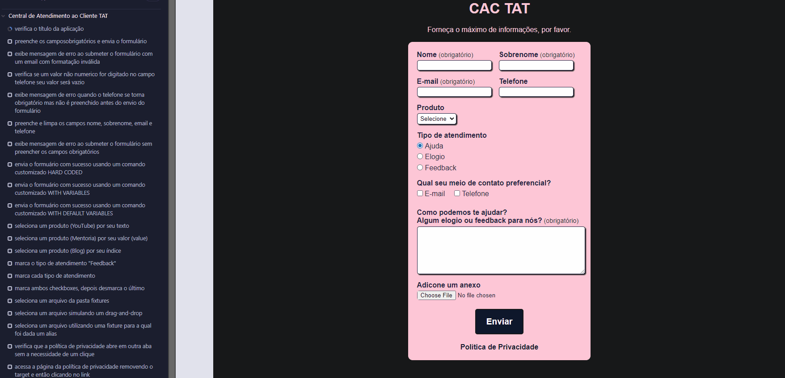

# 🌲 Cypress, from Zero to the Cloud ☁️

This is a sample project for the "Cypress, from Zero to the Cloud" course of the [**Talking About Testing School**](https://udemy.com/user/walmyr)

🗣️ **Note:** This project and its test code are written in **Brazilian Portuguese**, following the original course material.

## 📸 Demo

Here’s a quick look at the tests in action:

## 🛠️ Pre-requirements

Before you begin, make sure you have the following installed on your machine:

- [Git](https://git-scm.com/) - `2.50.1` version
- [Node.js](https://nodejs.org/) - `v22.17.1` version
- [npm](https://www.npmjs.com/) - `10.9.2` version

> It's recommended to use these or newer **LTS** versions for best compatibility.

## 📦 Installation

Clone the repository and install the dependencies:

Run `npm install` (or `npm i` for the short version) to install the dev dependencies.

## 🧪 Running the Tests

This project supports running tests in both desktop and mobile viewports.

### 🖥️ Desktop

To run tests in headless mode(faster, for automation):

- Run `npm test` (or `npm t` for the short version).

Or, open the Cypress App interface:

- Run `npm run cy:open`.

## 📱 Mobile

To run tests simulating a mobile viewport in headless mode:

- Run `npm run test:mobile`.

Or, open the Cypress App with the mobile configuration:

- Run `npm run cy:open:mobile`.

## 💖 Support this project

If you found this project helpful or inspiring, feel free to leave a ⭐️.
